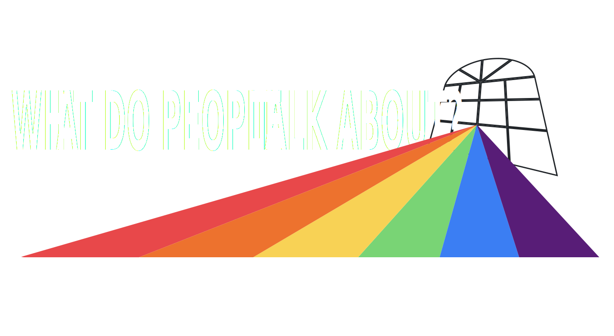

# ocss-dashboard



There exists no comprehensive solution to appraise the sentiment of online social media platforms. This is a pressing issue, as the use of these platforms is ubiquitous, especially for members of marginalized communities. Despite endless hours spent using these platforms by everyday users, research of the messages’ contents is not immediately apparent, straightforward, or accessible. Research into the opinions and experiences shared within these communities can offer altruistic opportunities, especially the dissemination of medical outcomes and their success rates.

To enable this accessibility, as a juncture of computer science and social science, this website is built with React and Flask to bridge the gap between otherwise unwieldy magnitudes of text data and straightforward sentiment analysis. This project intends to help social scientists analyze these social platforms. The website will likely go on to contain more advanced features within its lifetime, including measuring linguistic trends and interactions between groups on the Internet.

# Getting Started

The configuration of the project currently connects to remote servers.
These remote servers are currently hardcoded in the source code and use GPUs
for finding embeddings, connecting to a Reddit database, and sentiment analysis.

Running on a local machine (any development machine, your personal computer for instance which has a GUI and is not headless)
runs the frontend, backend, database, and adminer. This is done with `make local`.


.env

```
POSTGRES_USER=myuser
POSTGRES_PASSWORD=mypassword
POSTGRES_DB=mydatabase
CH_HOST=localhost
CH_PORT=8123
CH_DATABASE=default
CH_USER=default
CH_PASSWORD=heyheyhey
VITE_FIREBASE_API_KEY=fillMeOut
VITE_FIREBASE_AUTH_DOMAIN=fillMeOut
VITE_FIREBASE_PROJECT_ID=fillMeOut
VITE_FIREBASE_STORAGE_BUCKET=fillMeOut
VITE_FIREBASE_MESSAGING_SENDER_ID=fillMeOut
VITE_FIREBASE_APP_ID=fillMeOut
VITE_FIREBASE_MEASUREMENT_ID=fillMeOut
```

Which computers to use?

typically any computer should be able to run the 
backend + db + frontend + rabbit, that is done using docker compose.

```bash
make
```

However, we need another computer with a strong enough GPU that
can host Ollama.

```bash
cd backend/llama
make
cd ../topic
make
```

Clickhouse instructions not listed here yet, but can be found in torrent folder.
